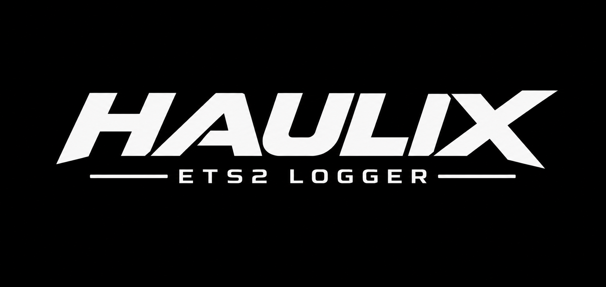

<b>Your free logbook and co-driver for Euro Truck Simulator 2.</b> 
Every delivery logged automatically, live job data, achievements and a HUD over your game – no account, no ads.

  <a href="../../releases/latest"><b>⬇ Download HAULIX</b></a> ·
  <a href="https://www.haulix-logging.com">Website</a> ·
  <a href="CHANGELOG.md">What's new</a> ·
  <a href="#deutsch">Deutsch</a>

---

## What HAULIX does for you

- 📒 **Automatic logbook** – every job is saved with route, cargo, income, XP, fuel, damage and a **driving score** from 0 to 100. Export to CSV or share a picture of your best runs.
- 🚚 **Current job page** – route and progress, real-time arrival time, deadline buffer, tolls, ferries and fines, a live driving score, a speed profile and a timeline of your trip.
- 🎮 **In-game HUD** – a clean job card over your game like VTC trackers use. Choose what it shows, its style, size and colour, and **drag it anywhere on your screen**.
- 🔔 **Notifications over the game** – milestones, deadline, fuel, damage and rest reminders, optionally **read out by a natural voice** (German and English, works offline).
- 🏆 **Achievements** – more than 60 goals in bronze, silver, gold and platinum, with a driver rank that grows with your career.
- 🏢 **Your company at a glance** – trucks, trailers, garages, drivers and money, read straight from your save game.
- 🌍 **German and English**, and updates with one click.

Coming later: find and join a VTC, events & convoys, job board, leaderboards and cloud sync.

## Get started

1. Download **`Haulix.exe`** from the [latest release](../../releases/latest).
2. Run it and click **Install**. HAULIX installs for your Windows user only – no admin rights needed – and sets up the free telemetry plugin in ETS2 for you.
3. Start ETS2 and confirm the *Advanced SDK features* question once. HAULIX switches to **LIVE** and starts logging.

**Requirements:** Windows 10 or 11 and Euro Truck Simulator 2. Everything else comes with the setup – if your PC is missing the Microsoft Edge WebView2 Runtime (some Windows 10 PCs), the setup installs it automatically. You do **not** need to install .NET.

## Good to know

- **"Windows protected your PC"?** HAULIX is new and not code-signed yet. Click **More info → Run anyway**.
- **HUD and notifications not showing in the game?** They need ETS2 in *borderless fullscreen* or window mode. HAULIX can switch that for you: *Settings → Notifications → ETS2 display mode*.
- **Updates:** HAULIX checks for new versions when it starts and every 6 hours. Click *Install now* and it updates itself – your logbook and settings stay.
- **TruckersMP:** HAULIX works on TruckersMP too. It can warn you before the AFK kick. The optional anti-AFK message breaks the TruckersMP rules and can get you banned, so it is off by default – use it at your own risk.

## Your privacy

Everything stays on your PC (`%LOCALAPPDATA%\Haulix`). HAULIX has no account and sends nothing about you anywhere. The only thing it asks the internet is whether there is a new version (you can turn that off in *Settings → About*). Full details: [Privacy Policy](PRIVACY.md).

## Help & feedback

Found a bug or have an idea? [Open an issue](../../issues). Please include your HAULIX version (*Settings → About*) and what you were doing.

Want to build HAULIX yourself or contribute? See [docs/DEVELOPING.md](docs/DEVELOPING.md).

## Legal

**HAULIX © 2026 RyanTMP. All rights reserved.** HAULIX is free for personal use under the [HAULIX License Agreement](LICENSE); copying, reselling or modifying it is not allowed. The source code is public so you can see what HAULIX does, but that grants no further rights. The **HAULIX name, logo and artwork** belong to RyanTMP – see [NOTICE.md](NOTICE.md). How HAULIX handles data: [Privacy Policy](PRIVACY.md). (Versions up to 0.0.7 were released under the GNU GPL v2.)

HAULIX is an independent fan project and is not affiliated with or endorsed by SCS Software, TruckersMP or any other company. *Euro Truck Simulator 2* and *American Truck Simulator* are trademarks of SCS Software. All other names and trademarks belong to their owners.

HAULIX uses great work by others – the SCS telemetry plugin by RenCloud, uPlot, Lucide, Piper, .NET, SQLite, WebView2 and the fonts Inter, Barlow and JetBrains Mono. Owners and licences: [THIRD-PARTY-NOTICES.md](THIRD-PARTY-NOTICES.md).

## Deutsch

**HAULIX** ist dein kostenloses Fahrtenbuch und Beifahrer für Euro Truck Simulator 2: Jede Lieferung wird automatisch gespeichert, du siehst Live-Daten zu deinem Auftrag, sammelst Erfolge und hast ein HUD über dem Spiel – ohne Konto, ohne Werbung.

**Das kann HAULIX**
- Automatisches **Fahrtenbuch** mit Route, Einnahmen, Kraftstoff, Schäden und **Fahrscore**.
- **Aktueller Auftrag**: Fortschritt, Echtzeit-Ankunft, Frist, Maut, Fähren, Bußgelder, Live-Fahrscore, Geschwindigkeitsprofil und Verlauf.
- **Ingame-HUD** als Auftragskarte – Inhalt, Stil, Größe und Farbe frei wählbar, **per Maus an jede Stelle ziehen**.
- **Benachrichtigungen** über dem Spiel, auf Wunsch von einer **natürlichen Stimme** vorgelesen.
- Über 60 **Erfolge** in Bronze, Silber, Gold und Platin mit Fahrerrang.

**Installation:** Lade `Haulix.exe` aus dem [neuesten Release](../../releases/latest) herunter und starte es. HAULIX wird nur für deinen Windows-Benutzer installiert (ohne Adminrechte) und richtet das Telemetrie-Plugin in ETS2 ein. Warnt Windows SmartScreen, klicke auf *Weitere Informationen → Trotzdem ausführen*.

**Voraussetzungen:** Windows 10 oder 11 und Euro Truck Simulator 2. Fehlt die Microsoft Edge WebView2 Runtime (auf manchen Windows-10-PCs), installiert das Setup sie automatisch. .NET musst du nicht installieren.

**Datenschutz:** Alles bleibt auf deinem PC. HAULIX fragt im Internet nur, ob es eine neue Version gibt. Details: [Datenschutzerklärung (englisch)](PRIVACY.md) · Lizenz: [HAULIX-Lizenzvertrag](LICENSE) – kostenlos für den privaten Gebrauch.

**Updates:** HAULIX prüft beim Start und alle 6 Stunden auf neue Versionen und aktualisiert sich mit einem Klick – Fahrtenbuch und Einstellungen bleiben erhalten. Alle Änderungen stehen im [Changelog](CHANGELOG.md) und in HAULIX unter *Einstellungen → Über → Neuigkeiten*.
